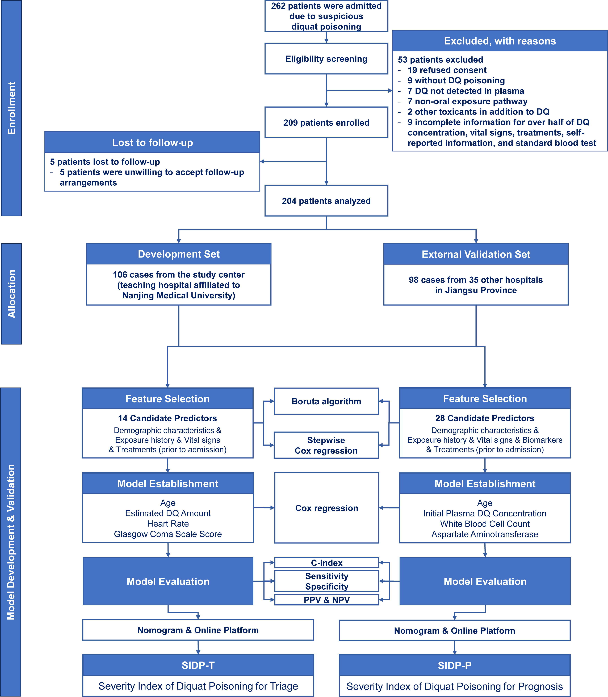
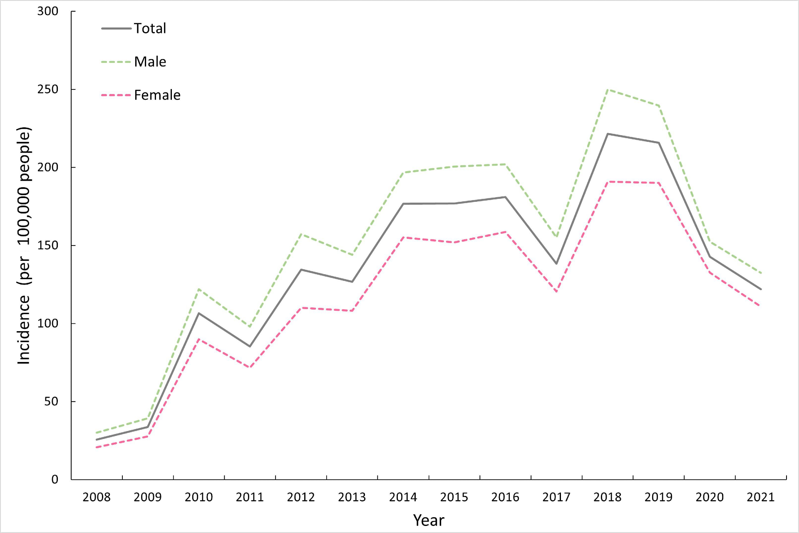
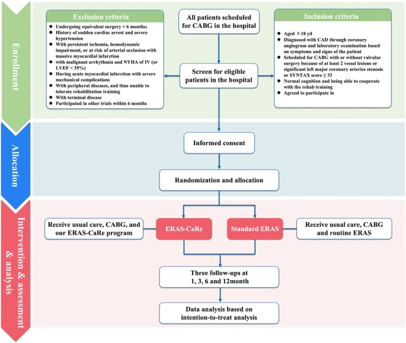
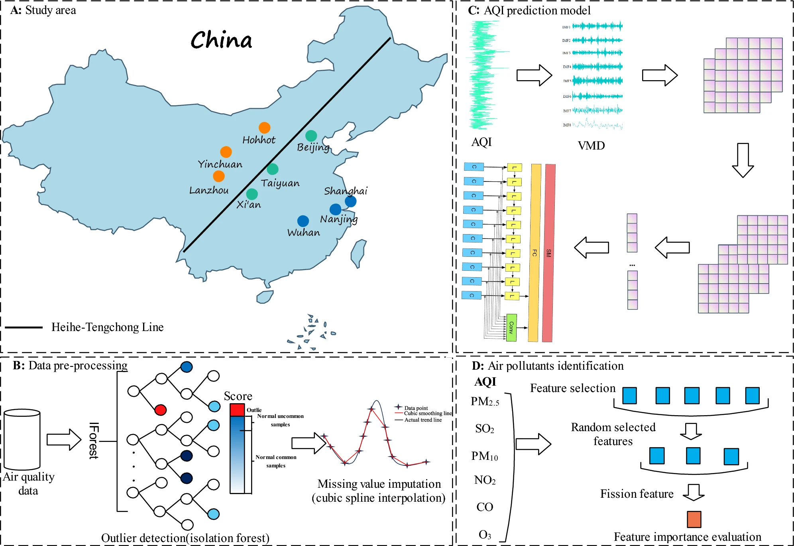
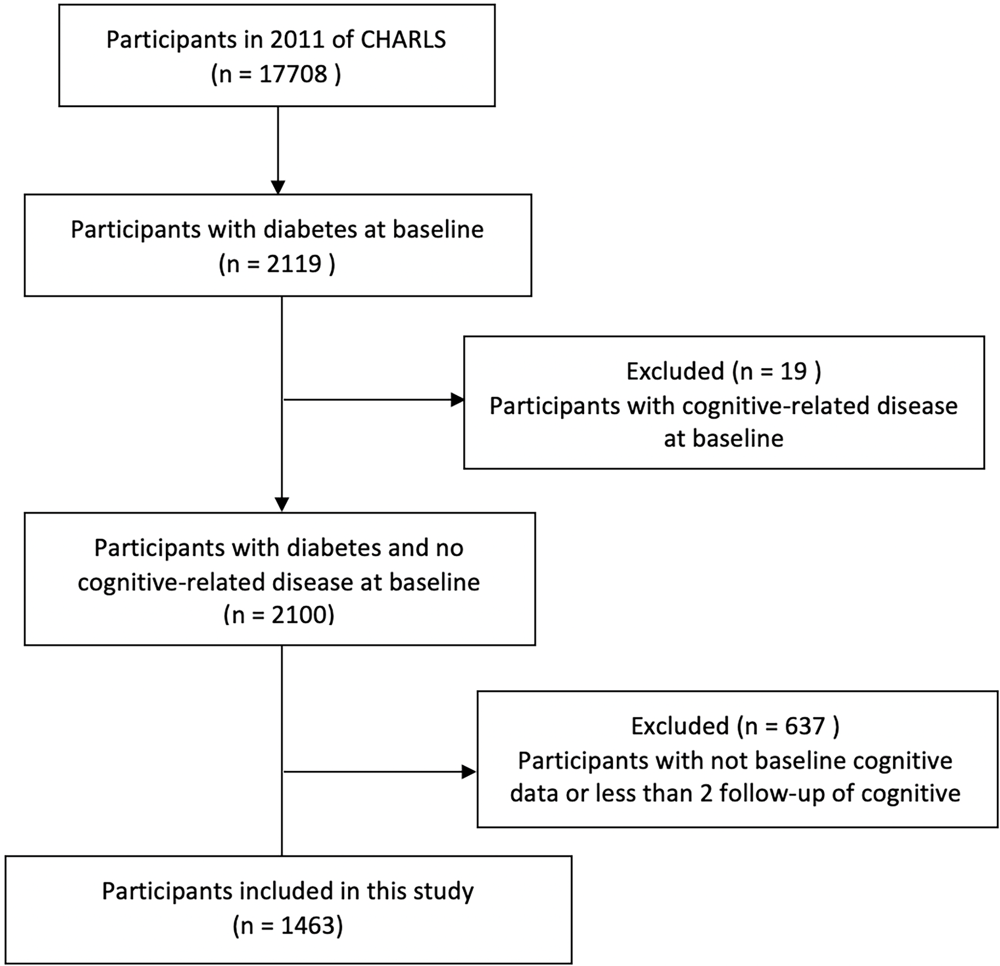
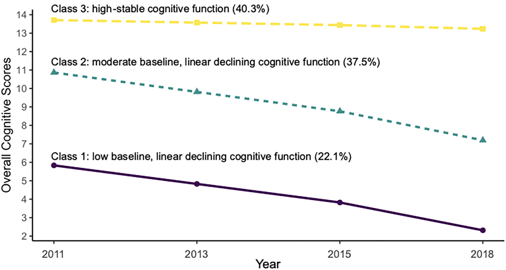
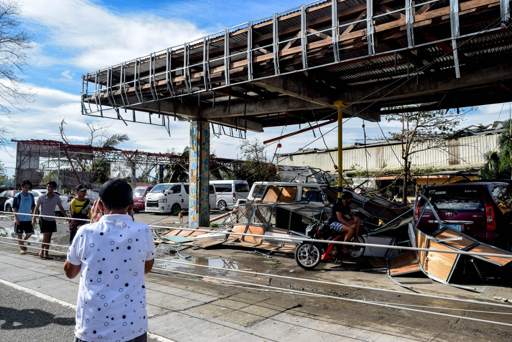
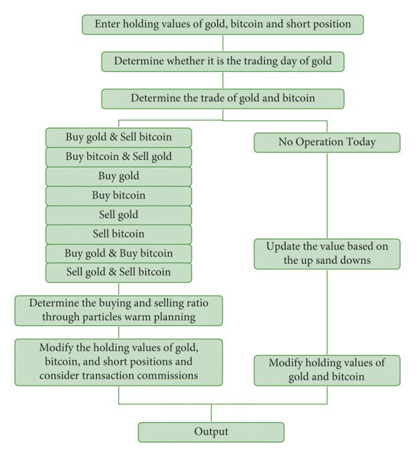

# 📝Publications

Annals of Emergency Medicine

[**Severity indices of diquat poisoning for triage and prognosis in acute diquat poisoning: a multi-center prospective cohort study**](https://doi.org/10.1016/j.annemergmed.2025.02.022) | 2025 
**Ling Y**, Mao Z, Liu W, Zhou C, Li J, Jiang L, Li M, Zhao H, Nie S, Wu C, Chen J, Bai G, Ren G, Xu J, Chen F, Zhang J, Sun H
- A comprehensive study establishing severity indices for acute diquat poisoning to guide clinical triage and predict patient prognosis.
- This research provides [**critical tools**](https://severityindexofdiquatpoisoning.streamlit.app/) for emergency medical professionals dealing with this severe toxicological emergency.
- 

JMIR Public Health and Surveillance

[**Trends and turning points of hand, foot and mouth disease in China: An insight into the influence of EV71 vaccine and COVID-19 epidemic based on counterfactual model**](https://publichealth.jmir.org/2024/1/e63146) | 2024 
Nie J, Huang T, Sun Y, Peng Z, Yang H, Zheng D, Guo F, Xu M, **Ling Y**, Zhao W, Yan X, Shui T
- This study analyzes the epidemiological trends of hand, foot, and mouth disease in China, with a focus on evaluating the impact of the EV71 vaccine implementation and the COVID-19 pandemic.
- Using counterfactual modeling approaches, we identify key turning points in disease prevalence and transmission patterns.

BMC Pulmonary Medicine

[**Impact of an enhanced recovery after surgery program integrating cardiopulmonary rehabilitation on post-operative prognosis of patients treated with CABG: protocol of the ERAS-CaRe randomized controlled trial**](https://doi.org/10.1186/s12890-024-03286-1) | 2024 
Yang Q#, Wang L#, Zhang X#, Lu P#, Pan D#, Li S#, **Ling Y**#, Zhi X#, Xia L, Zhu Y, Chen Y, Liu C, Jin W, Reinhardt JD, Wang X, Zheng Y
- This protocol outlines a randomized controlled trial designed to evaluate the effectiveness of an enhanced recovery after surgery (ERAS) program that incorporates cardiopulmonary rehabilitation for patients undergoing coronary artery bypass grafting (CABG).
- The study aims to improve post-operative outcomes and quality of life for cardiac surgery patients.

Scientific Reports

[**Optimized air quality management based on air quality index prediction and air pollutants identification in representative cities in China**](https://doi.org/10.1038/s41598-024-68972-w) | 2024 
Guo Z, Jing X, **Ling Y***, Yang Y, Jing N, Yuan R, Liu Y
- This research presents an optimized approach to air quality management in major Chinese cities.
- We develop predictive models for air quality indices and identify key pollutants, providing data-driven recommendations for environmental policy and public health interventions.

Chinese Journal of Health Policy

[**Research on the construction of a value adjustor for the inpatient rehabilitation services based on the principle of value-based health care**](https://doi.org/10.1371/journal.pone.0299316) | 2024 
Wang X, Li J, Wei X, Liu S, Li J, Li Y, **Ling Y**, Lu D, Chen J
- This study explores the development of a value-based adjustment mechanism for inpatient rehabilitation services in the Chinese healthcare system.
- We propose a framework that aligns reimbursement with patient outcomes, promoting higher quality care and cost-effectiveness in rehabilitation settings.

PLOS ONE

[**Trajectories of cognitive decline among people over 45 years old with diabetes in China: a nationally representative longitudinal study (2011~2018)**](https://doi.org/10.1371/journal.pone.0299316) | 2024 
Chen S#, **Ling Y**#, Zhou F, Qiao X, Reinhardt JD
- Using a nationally representative longitudinal dataset, this study identifies and characterizes distinct trajectories of cognitive decline among middle-aged and older adults with diabetes in China.
- We highlight key risk factors and potential intervention points to mitigate cognitive deterioration in this vulnerable population.

APN Science Bulletin

[**Developing capacity for post-typhoon disaster waste management in Lautoka, Fiji, and Makati, Philippines**](https://www.apn-gcr.org/bulletin/article/developing-capacity-for-post-typhoon-disaster-waste-management-in-lautoka-fiji-and-makati-philippines/) | 2023 
Fernandez G, Asari M, Uy N, Veitata S, Fayazi M, **Ling Y**, Xu Q, Wang H, Ramos LV, and Singh S
- This paper documents capacity-building efforts for disaster waste management in typhoon-prone regions of the Pacific.
- Through international collaboration, we develop and implement strategies to improve post-disaster recovery and build community resilience in vulnerable coastal cities.

Computational Intelligence and Neuroscience

[**Portfolio Optimization Model for Gold and Bitcoin Based on Weighted Unidirectional Dual-Layer LSTM Model and SMA-Slope Strategy**](https://www.hindawi.com/journals/cin/2022/1869897) | 2022 
Xue Q, **Ling Y**, Tian B
- This research develops an advanced portfolio optimization approach for alternative assets, specifically gold and Bitcoin.
- We implement a weighted unidirectional dual-layer LSTM model combined with a simple moving average (SMA) slope strategy to enhance investment returns while managing risk in volatile crypto markets.

## Working Papers

- **Ling Y**, Meng Q, Zhang Y, Zhang T, Liu K, Chen S, Yuan X, Liu S, Wang S, Yang Z, Jiang H, Fu Y. Investigation on the dynamic trajectory of platelet count in healthy population from 2010 to 2021 in Sichuan Han adult. (Accepted by *Chinese Journal of Laboratory Medicine*; in Chinese)

- **Ling Y**, Mao Z, Li J, Zhang H, Zhou C, Liu W, Zhou Y, Jiang L, Li M, Zhao H, Nie S, Xu J, Geng P, Xu C, Huang J, Chen F, Zhang J, Sun H. Leveraging plasma concentration levels to optimize extracorporeal treatment in acute diquat poisoning: a multi-center retrospective cohort study. (Under Review at *Clinical Toxicology*)

- **Ling Y***, Shahmon E, Brandeau ML, Yamin D. Improving imputation of missing data in time series through multi-scale modeling of periodicity: a smartwatch application. (Submitted to *Information Fusion*)

- **Ling Y**, Hui J, Fernandez G, Xu Q, Wang H. Content analysis of policies on disaster waste management in Sichuan, China: trends and ways forward. (Submitted to *Progress in Disaster Science*)

(# for equal contribution, * for corresponding author)
