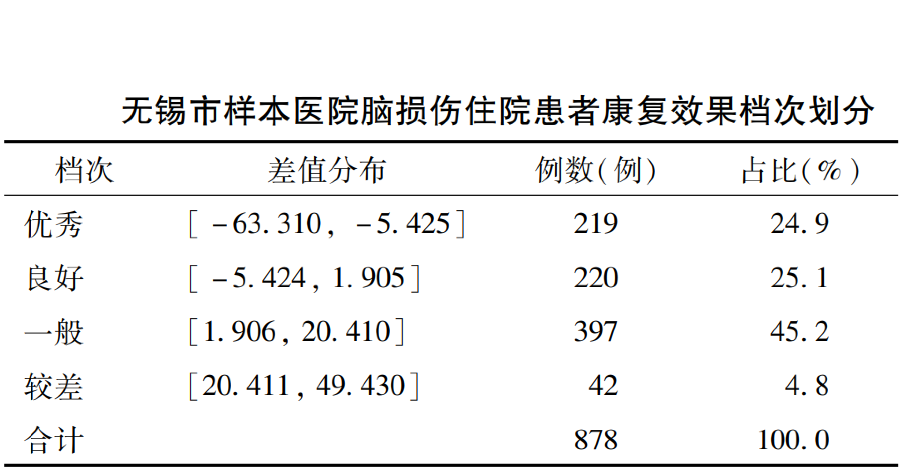

# 📚Publications

Annals of Emergency Medicine

[**Severity indices of diquat poisoning for triage and prognosis in acute diquat poisoning: a multi-center prospective cohort study**](https://doi.org/10.1016/j.annemergmed.2025.02.022) | 2025 
**Ling Y#**, Mao Z#, Liu W#, Zhou C, Li J, Jiang L, Li M, Zhao H, Nie S, Wu C, Chen J, Bai G, Ren G, Xu J, Chen F, Zhang J, Sun H
- This study developed and validated severity indices for diquat poisoning (SIDPs) that enable emergency physicians to assess mortality risk for triage and 28-day prognosis using self-reported clinical data and laboratory biomarkers.
- This multicenter cohort study involved 204 patients. Predictors identified by the Burota algorithm and stepwise Cox regression were incorporated into Cox proportional hazards models to develop SIDPs, one for triage and one for prognosis (SIDP-T and SIDP-P, respectively).
- We launched a user-friendly [**online platform**](https://severityindexofdiquatpoisoning.streamlit.app/) that enables emergency physicians to apply severity indices directly at the point of care.

JMIR Public Health and Surveillance

[**Influence of the Enterovirus 71 Vaccine and the COVID-19 Pandemic on Hand, Foot, and Mouth Disease in China Based on Counterfactual Models: Observational Study**](https://publichealth.jmir.org/2024/1/e63146) | 2024 
Nie J, Huang T, Sun Y, Peng Z, Yang H, Zheng D, Guo F, Xu M, **Ling Y**, Zhao W, Yan X, Shui T
- This study evaluated the long-term epidemiological trends of hand, foot, and mouth disease in Yunnan Province, China, and assess the impacts of the enterovirus 71 vaccination program and the COVID-19 pandemic using counterfactual autoregressive integrated moving average models.

BMC Pulmonary Medicine

[**Impact of an enhanced recovery after surgery program integrating cardiopulmonary rehabilitation on post-operative prognosis of patients treated with CABG: protocol of the ERAS-CaRe randomized controlled trial**](https://doi.org/10.1186/s12890-024-03286-1) | 2024 
Yang Q#, Wang L#, Zhang X#, Lu P#, Pan D#, Li S##, **Ling Y#**, Zhi X#, Xia L, Zhu Y, Chen Y, Liu C, Jin W, Reinhardt JD, Wang X, Zheng Y
- This protocol designed a pragmatic, randomized-controlled, parallel four-arm, clinical trial to evaluate possible superiority of embedding cardiopulmonary rehabilitation in enhanced recovery after surgery (ERAS) over ERAS alone as well as to investigate effects of differential timing of cardiopulmonary rehabilitation within enhanced recovery after surgery (pre-, post-, perio-operative) on post-operative cardiopulmonary complications following coronary artery bypass grafting surgery.

Scientific Reports

[**Optimized air quality management based on air quality index prediction and air pollutants identification in representative cities in China**](https://doi.org/10.1038/s41598-024-68972-w) | 2024 
Guo Z, Jing X, **Ling Y***, Yang Y, Jing N, Yuan R, Liu Y
- This study developed a VMD-CSA-CNN-LSTM model using variational mode decomposition (VMD), chameleon swarm algorithm (CSA), convolutional neural networks (CNN), and long short-term memory (LSTM) networks, with data from nine representative cities, and used random forest to identify major air pollutants.

Chinese Journal of Health Policy

[**Research on the construction of a value adjustor for the inpatient rehabilitation services based on the principle of value-based health care**](http://journal.healthpolicy.cn/html/20240307.htm) | in Chinese | 2024 
Wang X, Li J, Wei X, Liu S, Li J, Li Y, **Ling Y**, Lu D, Chen J
- This study constructed a value adjustor for inpatient rehabilitation services that enables comparable assessment of rehabilitation outcomes, supporting value-based payment reform under Chinese healthcare insurance system.

PLOS ONE

[**Trajectories of cognitive decline among people over 45 years old with diabetes in China: a nationally representative longitudinal study (2011~2018)**](https://doi.org/10.1371/journal.pone.0299316) | 2024 
Chen S#, **Ling Y#**, Zhou F, Qiao X, Reinhardt JD
- This study found three cognitive trajectories among Chinese adults aged 45 and older with diabetes using data from the nationally representative China Health and Retirement Longitudinal Study (CHARLS). 
- We employed a growth mixture model to identify cognitive trajectories, and examined baseline risk factors using weighted multinomial logistic regression.

APN Science Bulletin

[**Developing capacity for post-typhoon disaster waste management in Lautoka, Fiji, and Makati, Philippines**](https://www.apn-gcr.org/bulletin/article/developing-capacity-for-post-typhoon-disaster-waste-management-in-lautoka-fiji-and-makati-philippines/) | 2023 
Fernandez G, Asari M, Uy N, Veitata S, Fayazi M, **Ling Y**, Xu Q, Wang H, Ramos LV, and Singh S
- This work aimed to enhance the capacity of Lautoka, Fiji, and Makati, Philippines, for effective post-typhoon disaster waste management.
- The project conducted training needs assessments, developed and delivered six targeted training modules, facilitated stakeholder workshops, and guided the participatory creation of disaster waste management contingency plans, supported by international academic collaboration.

Computational Intelligence and Neuroscience

[**Portfolio Optimization Model for Gold and Bitcoin Based on Weighted Unidirectional Dual-Layer LSTM Model and SMA-Slope Strategy**](https://www.hindawi.com/journals/cin/2022/1869897) | 2022 
Xue Q, **Ling Y**, Tian B
- This study integrates a weighted unidirectional dual-layer long short-term memory (LSTM) model for daily price prediction with a particle swarm-optimized SMA-slope strategy, which enhances buy/sell signals using *k*-slope indicators, and evaluates its effectiveness through five-year trading simulations.

## Working Papers

- **Ling Y**, Meng Q, Zhang Y, Zhang T, Liu K, Chen S, Yuan X, Liu S, Wang S, Yang Z, Jiang H, Fu Y. Investigation on the dynamic trajectory of platelet count in healthy population from 2010 to 2021 in Sichuan Han adult. (Under Review at *Chinese Journal of Laboratory Medicine*; in Chinese)

- **Ling Y#**, Mao Z#, Li J#, Zhang H, Zhou C, Liu W, Zhou Y, Jiang L, Li M, Zhao H, Nie S, Xu J, Geng P, Xu C, Huang J, Chen F, Zhang J, Sun H. Leveraging plasma concentration levels to optimize extracorporeal treatment in acute diquat poisoning: a multi-center retrospective cohort study. (Under Review at *Clinical Toxicology*)

- **Ling Y#**, Shahmon E#, Brandeau ML, Yamin D. Improving imputation of missing data in time series through multi-scale modeling of periodicity: a smartwatch application. (Submitted to *Information Fusion*)

- **Ling Y**, Hui J, Fernandez G, Xu Q, Wang H. Content analysis of policies on disaster waste management in Sichuan, China: trends and ways forward. (In Preparation for *Progress in Disaster Science*)

(# for equal contribution, * for corresponding author)